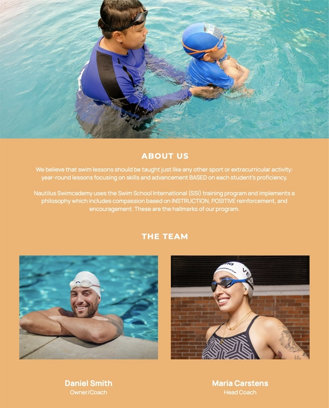

 # Nautilus Swim Academy

 Welcome to the Nautilus Swimcademy Website.

 The Nautilus Swimcademy is a landing page for people (parents & childern) who have a desire to learn to swim, improve their swimming technique, get healthy & improve fitness or to overcome their fear of water. 

 Users of this website will be able to find information to: 

  1. learning the benefits of swimming;
  
  2. help choose the right class as well as the fee structure of each class;

  3. learn about the Academy ethos and teaching practice;

  4. see a gallery of images about the Academy;

  5. ablity to contact the Academy and sign-up and find the location via a map.

  

 [You can view this website here](https://reubes77.github.io/nautilus-swim-academy/contact.html)

 # UX

 ### Rationale

When starting the journey on the home page, we wanted the user to get excited in taking this step to becoming a swimmer. We felt the use of a visually heroic image of a swimmer mid-stroke rising from the water would create a sense of inspiration. We used this principle to drive each page which the user would navigate to, namely, About Us and the Classes & Fees pages. We felt it important to also add a Gallery page to showcase the diverse students at our Academy and so motivate the user even more to take action and sign up. Our Contact Us page allowed the user to be able to sign-up using the form or call us, allowing additional options for communication with the Academy. We also thought that incorporating a map with a pin location would also provide more information for the user if they desired to visit us.

### Colour Scheme

We used 3 basic colors groups to drive the website visually from a color perspective. The primary colour group used is Blue which drives a sense of competence and trust. The second colour group used is Orange which drives confidence and bravery and the third colour group is white which drives honesty and simplicity and this is also accompanied by greys which help soften certain elements in our website.

  - #085394 / #9fc5f8 / #6fa8dc used as background color for home and classes pages.

  - #f6b26b / #ff9900 used for fees structure and background color for about page.

  - #222831 used for navbar, headlines and text.

  - #ffffff used for headlines and primary text, background color for fees and contact page.

  - #e3e3e3 used for secondary text.

  - #eeeeee used for tertiary text.

  

### Typography

  [fonts.google.com](https://fonts.google.com/) was used to help generate font pairings as follows:

  - Montserrat was used for the primary headers.
  - Manrope was used for subheadings and all other text.
  - Montserrat and Manrope were selected as they are both readable and clear fonts, which is ideal for main headings 
    and large sections of text.

  Font Awesome icons were used throughout the site, such as the social media icons in the footer.

### Wireframes created on Balsamiq:

Before we started designing the website, we went to the drawing board to map out the design structure. 
We used Balsamiq to create a wireframe of our website.

## Case stories

  1. Parents realise the need to get their children comfortable and confident in the water at an early age.

  2. Parents want a trusted & reliable swim school to give their children the best skills to be good swimmers.

  3. Some adults have a fear of swimming which stems from their childhood and there is a realisation that they can break 
    that cycle and so search for a swim school.
  
  > Research shows 46 percent of adults are afraid to swim in deep water, and 32 percent of people are scared to put 
    their heads underwater.

  4.  Adults who have suffered form an injury want a exercise regime that is not too strenous on their bodies and find 
      through their research that swimming offers a more gentle method of becoming healthy & fit.

  5. Parents want their children to improve their swimming technique and decide to place them in a swimming school.

  6. Young children & teenagers get inspired by seeing athletes compete on television and want to swim competitively.

- ### First time user goals

  1. We want the first time user to feel that this is a trusted and reliable site.
 
  2. We want the first time user to easily navigate to find content. 
 
  3. We want the first time user to easily locate and engage with our social media platforms.
 
  4. We want to prompt the first time user to make contact with us or sign up to the classes.

- ### Business goals

  1. Drive feet to the website.
 
  2. Prompt action to sign-up by the first or second visit. 
  
  3. Gain interest and connect with social media.

# Features

- ### Navigation

  1. Navbar appears at the top of the website with the logo name appearing on the left and the menu list on the right.

  2. The menu list items: About Us, Classes & Fees, Gallery and Contact Us, each link to their specific pages.
 
  3. The navbar allows the user to easily navigate the website.
 

## Header

  1. Header contains a strong visual of a swimmer to excite the user into exploring the website.
 
  2. The header text informs the user to the reasons why swimming is important.
 
  3. The header texts leads the user to scroll to read more about the benefits of swimming.

## About Us

 

  1. The page has a header image to re-inforce trust as it showcases a coach teaching a child in the pool.
  
  2. The page allows users to learn more about the ethos and philosophy of the Academy.
 
  3. The page also notes the training programme followed to teach students.
 
  4. The page also describes the hallmarks of the program.

  5. The page also contains The Team section which introduces the owner and the coaches.

## Classes & Fees

  1. The page gives a brief overview of the operating times of the Academy as well as the facilities offered to students.
  
  2. Information about online registration is provided to further assist users in their decision making process.
  
  3. The page also contains a Fees section which shows the 3 categories of students and the fee for each category.

## Gallery

  1. Images are displayed an array of at the Academy.

  2. Images are displayed into 3 columns and stacked vertically in mobile view. 

  3. The images in the gallery space vertically automatically based on the gallery height.

## Contact Us 

  1. The Contact page contains the Academy contact details namely the address, phone numbers and a basic form.
  
  2. 
  
  3. 

## Sign Up Form

  1. The form allows users to get in touch with the Academy.
 
  2. The form requires the user inputs for validation in order to be submitted.
 
  3. The form also has a reset button allowing the user to easily clear the form fields.

## Map

  1. A map allows users to visually locate the Academy via Google Maps.

  2. The map gives the user the ablilty to physically visit the Academy if they choose to do so.

## Footer

  1. copy to go here.
 
  2. copy to go here.
 
  3. copy to go here.

## Pages to be created at a later stage:

  - Create a testimonial page to help promote the Academy through the voices of students and parents.

  - Create a quarterly newsletter to showcase the latest swimming techniques, eating tips for swimmers, swimming competitions 
    and upcoming events which the Academy holds such as social events.

# Testing

  - I have tested the website on Chrome, Firefox and Safari.

  - I can confirm that the website is responsive, functions on standard screen sizes using devtools device toolbar.
 
  - I can confirm that the navigation bar, header, about us, classes & fees, gallery and contact us text are all readible 
    and easy to understand.
 
  - I can confirm that the form works, requiring entry in every field, will only accept email address in email field, 
    the submit and reset buttons work. 

# Bugs

### Fixed Bugs

  - copy to go here.

  - copy to go here.
  
  - copy to go here.

### Unfixed Bugs

  copy to go here.

# Validator testing

  - HTML
    * No errors were returned when passing through the official W3C validator.

  - CSS
    * No errors returned when passing through the official W3C CSS Jigsaw validator.

  - Accesibility
    * I can confirm that the colors and fonts used are easily readible and accessible by running through Lighthouse in devtools.

# Deployment

  - The website was deployed via Github pages. The following steps were used to deploy this website:

    - In the Github repository, navigate to the Settings Tab, under the Code & automation section, click on the Pages Tab.
    
    - Under the Build and Deployment section, select the Source section drop-down menu, then select the Master Branch.

    - Once the Master Branch has been selected, click on the Branch drop-down menu and select Main tab and then click Save.
    
    - Go back to the Code tab and on the right-hand side, click on the Github pages under the Deployments section.
  
    - Under the Github-Pages Deployments section, click on the link to the completed website.

The live link can be found here: 

# Credits

### Content

  1. >Blog article by David Worrell in [We Aquatics] (https://weaquatics.com/blog/conquering-swim-anxiety/#:~:text=Over%2055%20percent%20of%20people,to%20put%20their%20heads%20underwater)

  2. The code for the Navbar sourced from the Love Running Project.

  3. The code to make the social media links work sourced from the Love Running Project.

### Media

  1. Images sourced from [pexel.com](https://www.pexels.com/)

  2. Device mockup from [freepik.com](https://www.freepik.com/).
