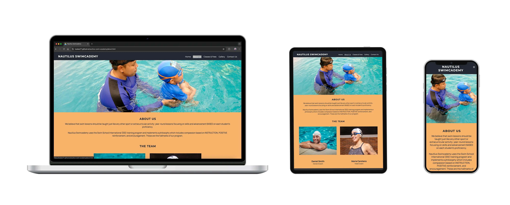

 # Nautilus Swim Academy

 Welcome to the Nautilus Swimcademy Website.

 The Nautilus Swimcademy is a landing page for people who have a desire to learn to swim, improve their swimming technique, get healthy & improve fitness or to overcome their fear of water. I wanted to create a website that give users a place to find information that would inform them about swimming and seeing this as a healthy lifestyle exercise options as well as attract parents who want to give their children the opportunity to learn to swim in order to better prepare them when faced with water. I aimed to make the website as intuitive and easily to navigate.  

 Users of this website will be able to find the following information: 

  1. learning the benefits of swimming;
  
  2. learn about the Academy ethos and teaching practice;
  
  3. help the user to choose the right class for them;

  4. find out about the fee structure of each class;

  5. see a gallery of images about the Academy;

  6. contact the Academy and sign-up and find the location via a map;

  7. interact with our social media channels.

  

 [You can view this website here](https://reubes77.github.io/nautilus-swim-academy/contact.html)

 ----

 # UX

 ### Creative Rationale

When starting the journey on the home page, we wanted the user to get excited in taking this step to becoming a swimmer. I made use of a visually dynamic movement image of a swimmer performing the butterfly stroke rising from the water, as this would create a sense of inspiration and awe. I used this principle to drive the following two pages (About Us and Classes & Fees pages) which the user would navigate to. I felt it important to also add a Gallery page to showcase the diverse students at the Academy and so motivate the user even more to take action and sign up. The Contact Us page allowed the user to be able to sign-up using the form or call, allowing additional options for communication with the Academy. I incorporated a map with a pin location to provide more information for the user if they desired to visit the Academy.

### Colour Scheme

Color drives emotion and careful consideration was taken in pairing colors to compliment each other and the visuals but also drive emeotion. I used 3 basic colors groups and two accent colors for the website to visually compliment the website from a color perspective. The primary colour group used is Blue which gives a sense of competence and trust. The second colour group used is Orange which denotes confidence and bravery and the third colour group is white which drives honesty and simplicity. The two accent colors are greys which compliments the  color white and help soften certain elements in our website. Below is a breakdown of the colors and their usage.

  - #085394 / #9fc5f8 / #6fa8dc used as background color for home and classes pages.

  - #f6b26b / #ff9900 used for fees structure and background color for about page.

  - #222831 used for navbar, headlines and about page text.

  - #ffffff used for headlines and primary text, background color for fees and contact page.

  - #e3e3e3 used for secondary text.

  - #eeeeee used for tertiary text.

  

### Typography

  [fonts.google.com](https://fonts.google.com/) was used to help generate font pairings as follows:

  - Montserrat was used for the primary headers.
  - Manrope was used for subheadings and all other text.
  - Montserrat and Manrope were selected because it is a sans serif and compliments the color pairing 
    of Blue and Orange as the font is functional and contemporary. Both are readable and clear fonts, 
    which is ideal for main headings and large sections of text.

  * Font Awesome icons were used throughout the site, such as the social media icons in the footer.

## Case stories

  1. Parents realise the need to get their children comfortable and confident in the water at an early age.

  2. Parents want a trusted & reliable swim school to give their children the best skills to be good swimmers.

  3. Some adults have a fear of swimming which stems from their childhood and there is a realisation that they can break 
    that cycle and so search for a swim school.
  
  > Research shows 46 percent of adults are afraid to swim in deep water, and 32 percent of people are scared to put 
    their heads underwater.

  4.  Adults who have suffered form an injury want a exercise regime that is not too strenous on their bodies and find 
      through their research that swimming offers a more gentle method of becoming healthy & fit.

  5. Parents want their children to improve their swimming technique and decide to place them in a swimming school.

  6. Young children & teenagers get inspired by seeing athletes compete on television and want to swim competitively.

- ### First time user goals

  1. We want the first time user to feel that this is a trusted and reliable site.
 
  2. We want the first time user to easily navigate to find content. 
 
  3. We want the first time user to easily locate and engage with our social media platforms.
 
  4. We want to prompt the first time user to make contact with us or sign up to the classes.

- ### Business goals

  1. Drive feet to the website.
 
  2. Prompt action to sign-up by the first or second visit. 
  
  3. Gain interest and connect with social media.

### Wireframes created on Balsamiq:

Before I started designing the website, I went to the drawing board to map out the design structure. 
I used Balsamiq to create a wireframe of the website.

# Features

## Navigation

  1. Navbar appears at the top of the website with the logo name appearing on the left and the menu list on the right.

  2. The menu list items: About Us, Classes & Fees, Gallery and Contact Us, each link to their specific pages.
 
  3. The navbar allows the user to easily navigate the website.

  4. In mobile view the menu list is contained in the burger icon and once activated, a drop-down menu appears revealing 
    the pages to the mobile version of the website.

## Header and Home page

   

  1. Header contains a strong visual of a swimmer to excite the user into exploring the website.
 
  2. The header image leads the user to scroll to read more about the benefits of swimming.
 
  3. The home page informs the user about the benefits of swimming and the benefits are contained within rectangular shapes 
    to creates an abstract visual cue of the waves created by swimmers in the swimming lanes of a pool.

## About Us

 

  1. The page has a header image to re-inforce competence (in our text which uses the Dark Blue) and bravery (in our background 
    color which uses Orange) as it showcases a coach teaching a child in the pool.
  
  2. The page allows users to learn more about the ethos and philosophy of the Academy.
 
  3. The page also notes the training programme followed to teach students.
 
  4. The page also describes the hallmarks of the program.

  5. The page also contains The Team section which introduces the owner and the coaches.

## Classes & Fees

#### Classes section

  1. The page has a header image which depicts a coach and student reinforcing the hands-on approach of the coaches 
    promoting the sense of competence. I used the Blue background color to push the sense of competence through color 
    with the white text driving the narrative of honesty.
  
  2. Information about online registration is provided to further assist users in their decision making process.
  
  3. The page also contains a Fees section which shows the 3 categories of students and the fee for each category.

  4. The page gives a brief overview of the operating times as well as the facilities offered.

#### Fees section

## Gallery

  1. Images are displayed are an array of the diversity in ages of the students at the Academy.

  2. Images are displayed into 3 columns and stacked vertically in mobile view. 

  3. The images in the gallery space vertically automatically based on the gallery height.

  4. The images are displayed vertically on a desktop computer with white border running vertically on the sides 
    and in the columns, which again continues the abstract visual cue of the swimming lanes of a pool.

## Contact Us 

#### Address

  1. The Contact page prompts users by means of a friendly tone to make contact 
    with the Academy by providing the address and phone numbers.

#### Sign Up Form

  1. The form allows users another method to sign up to the Academy.
 
  2. The form requires the user inputs for validation in order to be submitted.
 
  3. The form also has a reset button allowing the user to easily clear the form fields.

#### Map

  1. A map allows users to visually locate the Academy via Google Maps.

  2. The map gives the user the ablilty to physically visit the Academy if they choose to do so.

## Footer

  1. The footer contains the social media icons (Facebook, Instagram, Tik Tok, X), allowing users another 
    channel to find and interact with the Academy.
 
  2. The Footer tab is fixed to the bottom of the website allowing the user to easily interact with our social media icons.

## Pages to be created at a later stage:

  - I want to create a testimonial page to help promote the Academy through the voices of students and parents.

  - I want to create a quarterly newsletter to showcase the various topic such as the latest swimming techniques, eating tips for swimmers, swimming 
    competitions and upcoming swimming events as well as any social events which the Academy holds to raise funds for the school and charity.

----

# Technologies used:

  - HTML
    * Page markup.

  - CSS
    * Styling.

----

# Testing

  - I have tested the website on Chrome, Firefox and Safari.

  - I tested the website to see if it is responsive, functions on standard screen sizes using devtools device toolbar.
 
  - I have tested the navigation bar, header, about us, classes & fees, gallery and contact us text are all readible 
    and easy to understand.
 
  - The form works, requiring entry in every field, will only accept email address in email field, 
    the submit and reset buttons work. 

----

# Bugs

### Fixed Bugs

  - Fixed the navbar drop-down menu items.

  - Fixed the form position next to the address section.
  
  - Resolved the images in the Gallery to be responsive.

  - Fixed the Favicon links in the head of our html files.

### Unfixed Bugs

  - A score of 47 for the Gallery page was generated for the Performance Report as it picked up issues which I did not get to resolve.

  

  - A score of 74 for the Contact page was generated for the Best Practices Report as it picked up issues which was also not resolved.

  

----

# Validator testing

### HTML

I have used the recommended [HTML W3C Validator](https://www.w3.org/) to validate all of my HTML files.

##### Pass: No Errors

##### Pass: No Errors

##### Pass: No Errors

##### Pass: No Errors

##### Pass: No Errors

### CSS

I have used the recommended [CSS Jigsaw Validator](https://jigsaw.w3.org/css-validator/) to validate my CSS file.
 

##### Pass: No Errors

## Lighthouse Audit

I've tested my deployed project using the Lighthouse Audit tool to check for any major issues.

#### Home page:

#### About Us page:

#### Classes & Fees page:

#### Gallery page:

#### Contact Us page:

----

# Deployment

  - The website was deployed via Github pages. The following steps were used to deploy this website:

    - In the Github repository, navigate to the Settings Tab, under the Code & automation section, click on the Pages Tab.
    
    - Under the Build and Deployment section, select the Source section drop-down menu, then select the Master Branch.

    - Once the Master Branch has been selected, click on the Branch drop-down menu and select Main tab and then click Save.
    
    - Go back to the Code tab and on the right-hand side, click on the Github pages under the Deployments section.
  
    - Under the Github-Pages Deployments section, click on the link to the completed website.

The live link can be found [here:](https://reubes77.github.io/nautilus-swim-academy/)

----

# Credits

### Content

  1. >Blog article by David Worrell in [We Aquatics] (https://weaquatics.com/blog/conquering-swim-anxiety/#:~:text=Over%2055%20percent%20of%20people,to%20put%20their%20heads%20underwater)

  2. The code for the Navbar sourced from the Love Running Project.

  3. The code to make the social media links work sourced from the Love Running Project.

### Media

  1. Images sourced from [pexel.com](https://www.pexels.com/)

  2. Device mockup from [freepik.com](https://www.freepik.com/).
